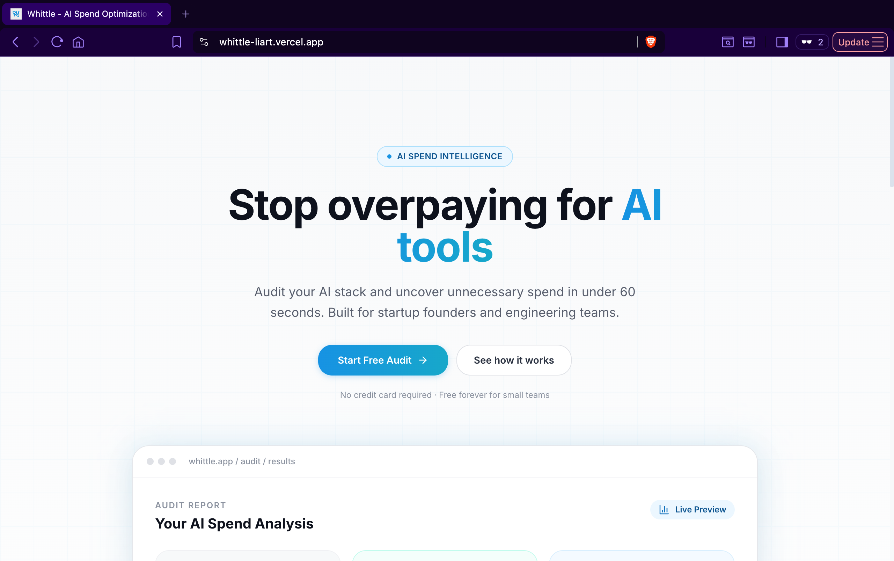
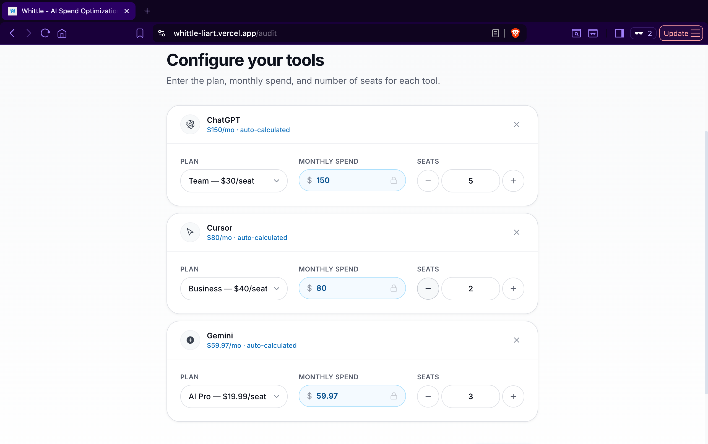
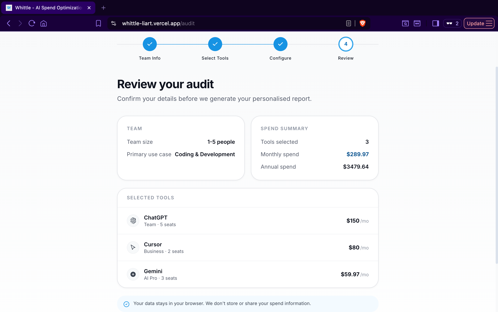
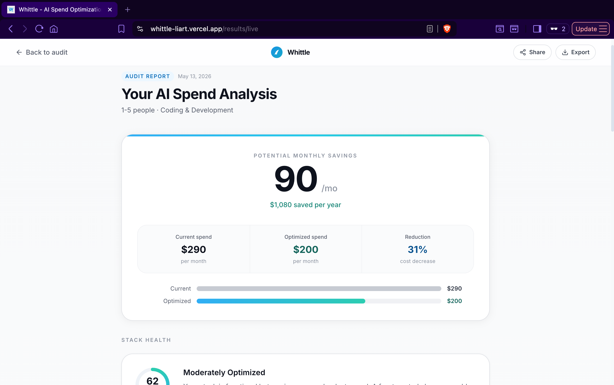
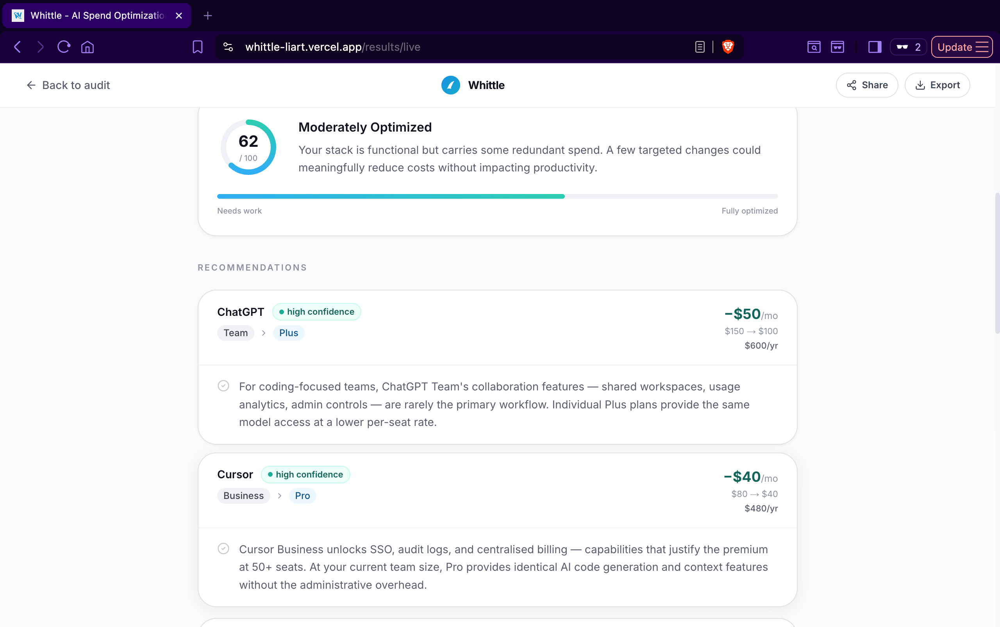
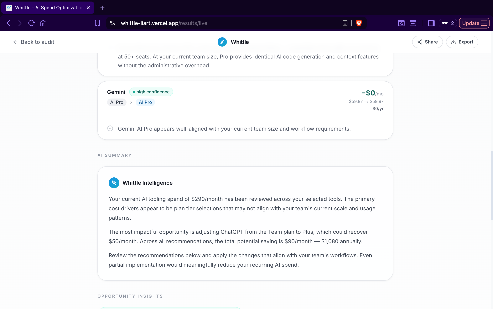
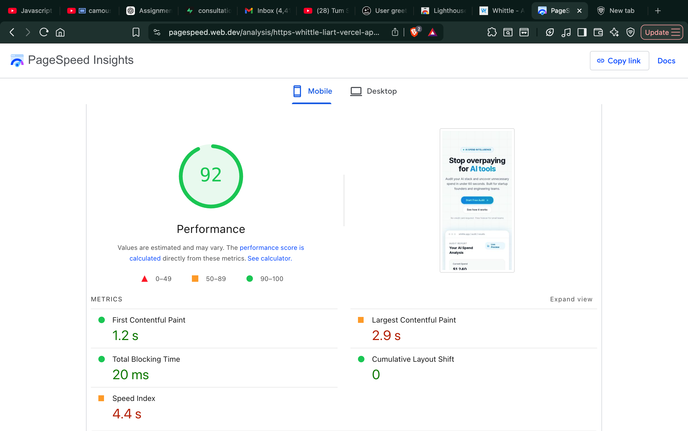

# Whittle — AI Spend Optimization Platform

Whittle is an AI spend optimization platform designed for startups, engineering teams, and growing companies struggling with overlapping AI subscriptions and inefficient tooling spend. The platform audits a team's AI stack, identifies redundant or oversized subscriptions, and generates a shareable optimization report with actionable savings recommendations.

Built as a lightweight but realistic procurement-intelligence MVP, Whittle focuses on explainable audit logic, deterministic recommendations, and a polished user experience instead of relying on black-box AI outputs.

---

# Live Demo

https://whittle-liart.vercel.app

---

# Screenshots

## Landing Page


## Audit Flow
1.Choose Ai tools :


2.Choose Ai Plans :


3.Choose Ai plans Review :


## Optimization Report


## Recommendation Engine




---

# Features

- AI stack auditing workflow
- Dynamic pricing-based spend calculation
- Multi-recommendation audit engine
- Capability overlap detection
- Rightsizing recommendations
- Team-size aware optimization logic
- Shareable public audit reports
- Open Graph social previews
- Lead capture + consultation forms
- Supabase-backed persistence
- Transactional email integration using Resend
- Honeypot-based abuse protection
- Mobile-optimized Lighthouse-compliant UI

---

# Audit Intelligence

Whittle does not rely on generic AI-generated recommendations.  
Instead, the platform uses a deterministic rule engine that evaluates:

- team size
- seat allocation
- plan tiers
- tool capability overlap
- stack composition
- redundant assistant usage
- enterprise plan overkill
- optimization confidence

The engine supports:
- multiple findings per report
- grouped overlap recommendations
- KEEP verdicts for healthy tooling
- stack-wide optimization scoring

Example findings:
- redundant AI assistant overlap
- oversized seat allocations
- unnecessary enterprise plans
- duplicated coding assistants
- healthy / well-optimized tooling

---

# Tech Stack

## Frontend
- Next.js 15
- React
- TypeScript
- Tailwind CSS
- shadcn/ui

## Backend / Infra
- Supabase
- Resend
- Vercel

## State & Validation
- Zustand
- React Hook Form
- Zod

---

# Quick Start

## 1. Clone the repository

```bash
git clone <your-repo-url>
cd whittle
```

## 2. Install dependencies

```bash
npm install
```

## 3. Configure environment variables

Create a `.env.local` file:

```env
NEXT_PUBLIC_SUPABASE_URL=your_url
NEXT_PUBLIC_SUPABASE_ANON_KEY=your_key
RESEND_API_KEY=your_resend_key
```

## 4. Run locally

```bash
npm run dev
```

App runs on:

```txt
http://localhost:3000
```

---

# Deployment

The project is deployed on Vercel.

## Production URL

[https://whittle-liart.vercel.app](https://whittle-liart.vercel.app)

## Deploy

```bash
vercel
```

---

# Lighthouse Scores

The application was optimized for mobile Lighthouse performance.

| Category       | Score |
| -------------- | ----- |
| Performance    | 92    |
| Accessibility  | 94    |
| Best Practices | 100   |
| SEO            | 100   |

Optimizations included:

* image compression
* OG asset optimization
* reduced layout shift
* semantic accessibility improvements
* reduced-motion support
* optimized font loading
* metadata cleanup




---

# Abuse Protection

Instead of adding a high-friction CAPTCHA flow, the project uses a lightweight honeypot-based spam prevention system.

Why:

* preserves UX
* avoids unnecessary friction
* appropriate for MVP-scale traffic
* effective against basic automated submissions

The honeypot field silently rejects bot submissions before they reach the backend or transactional email system.

---

# Open Graph Sharing

Shared reports generate dynamic Open Graph metadata and social preview cards.

This allows audit reports to:

* render rich previews on Slack/X/LinkedIn
* support shareable public URLs
* improve discoverability and product presentation

---

# Architecture Decisions & Trade-offs

## 1. Deterministic Audit Engine vs LLM-Generated Recommendations

### Decision

We chose a deterministic rule engine instead of generating recommendations using an LLM.

### Why

LLM-generated audits sounded intelligent but produced inconsistent, non-repeatable outputs. A deterministic engine allowed explainable recommendations, stable testing, and realistic optimization scoring.

### Trade-off

Less flexibility compared to a fully AI-driven system, but significantly higher reliability and trustworthiness.

---

## 2. Lightweight Capability Categories Instead of Complex Semantic Matching

### Decision

We implemented simple hardcoded capability buckets such as:

* chat-assistant
* coding-assistant
* research
* creative

### Why

This provided believable overlap detection without introducing vector search or embedding infrastructure.

### Trade-off

Less nuanced capability reasoning, but dramatically lower implementation complexity and failure risk.

---

## 3. Honeypot Protection Instead of hCaptcha

### Decision

Used honeypot spam prevention instead of CAPTCHA.

### Why

The goal was maintaining a smooth audit experience without interrupting users with verification challenges.

### Trade-off

Slightly weaker protection against sophisticated spam, but much better UX for a lightweight MVP.

---

## 4. Grouped Recommendations Instead of Recommendation Spam

### Decision

Overlap findings are grouped into consolidated recommendations.

### Why

Without grouping, reports became repetitive and visually noisy when multiple tools triggered similar overlap rules.

### Trade-off

Slight loss of granularity in exchange for cleaner and more product-quality reports.

---

## 5. Focused MVP Scope Instead of Enterprise Procurement Complexity

### Decision

The system intentionally avoids:

* procurement workflows
* contract management
* SSO analytics
* usage telemetry ingestion
* advanced billing reconciliation

### Why

The assignment goal was to build a believable optimization product, not a full enterprise procurement suite.

### Trade-off

Reduced operational depth, but significantly stronger execution quality and polish within the available timeframe.

---

# Challenges Faced During Development

* balancing realism vs over-engineering
* calibrating optimization scores
* preventing overly aggressive downgrade recommendations
* handling overlapping AI assistant logic
* maintaining believable audit outputs
* grouping recommendations cleanly
* generating meaningful KEEP verdicts
* preserving accurate savings calculations across grouped findings
* fixing floating-point currency precision issues
* optimizing Lighthouse mobile performance under deployment constraints

---

# Final Notes

Whittle was designed to feel less like a generic calculator and more like a realistic SaaS procurement assistant. The focus throughout development was not just generating savings, but producing recommendations that felt explainable, trustworthy, and operationally believable.

The final system supports deterministic multi-finding audits, overlap-aware recommendations, public sharing, consultation lead capture, and production-ready deployment — while remaining intentionally lightweight and maintainable.
