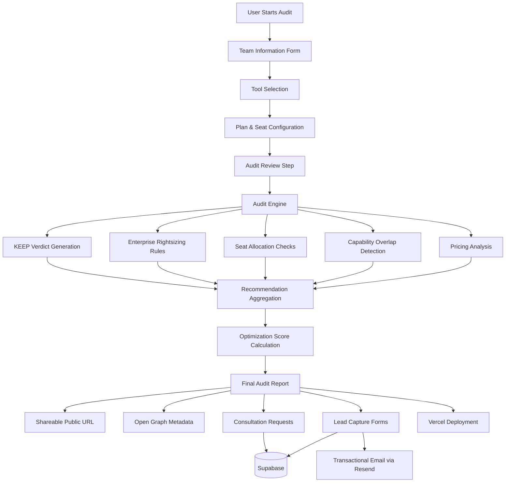

# ARCHITECTURE

## System Overview

Whittle is a deterministic AI spend optimization platform built to audit AI tooling stacks, identify inefficiencies, and generate explainable optimization recommendations.

The system combines:
- rule-based audit intelligence
- pricing analysis
- capability overlap detection
- lightweight lead capture
- shareable reporting infrastructure

The architecture was intentionally designed to remain lightweight, deterministic, and deployment-friendly while still producing believable procurement-style audit outputs.

---

# System Diagram

---

# Data Flow

## 1. User Input Collection

The audit begins with a multi-step onboarding flow where the user provides:

* team size
* use case
* selected AI tools
* pricing plans
* seat allocation

This data is stored in a lightweight client-side audit store (Zustand with localStorage persistence) before processing.

---

## 2. Audit Engine Execution

Once submitted, the data is passed into the deterministic audit engine (`src/services/audit/rules/engine.ts`).

The engine evaluates:

* current monthly spend against the pricing catalog
* annual spend projections
* tool capabilities and category mappings
* overlap between assistants in the same capability group
* oversized seat allocations relative to team size
* enterprise plan misuse on small teams
* stack composition quality and complexity

Unlike LLM-generated recommendations, all outputs are deterministic and explainable. The same input always produces the same output.

---

## 3. Recommendation Generation

The engine produces:

* optimization findings (downgrade, consolidate, remove)
* overlap warnings (redundant tools in the same capability group)
* rightsizing suggestions (seat count vs team size)
* KEEP verdicts for healthy tooling (transparent "no action needed" signals)

Recommendations are:

* grouped (overlapping tools merged into single cards)
* confidence-scored (high / medium / low)
* savings-aware (exact monthly and annual dollar amounts)
* stack-context aware (considers the full tool composition, not just individual tools)

---

## 4. Optimization Scoring

The scoring layer (`src/services/audit/calculators/scoreCalculator.ts`) evaluates:

* waste ratio — recoverable spend as a proportion of total spend (dominant signal)
* capability overlap severity (same-purpose tools)
* provider overlap (same vendor, multiple products)
* API spend concentration
* enterprise plan overkill on small teams
* seat inefficiency (high-tier plan with minimal seats)
* stack complexity (number of paid tools)

Penalties are weighted and subtracted from a base score of 100. The final score maps to a qualitative band (Fully Optimized → Needs Attention).

---

## 5. Report Rendering

The final audit report includes:

* optimization score with animated ring visualization
* projected monthly and annual savings
* recommendation cards with confidence badges
* AI-generated narrative summary (Gemini 2.5 Flash with deterministic fallback)
* opportunity insight chips
* consultation CTA (conditionally rendered for savings ≥ $100/mo)
* public sharing support with clipboard integration

Reports can be shared using public URLs (`/share/[id]`) with Open Graph previews for rich social media cards.

---

## 6. Lead Capture + Storage

Consultation and lead forms are persisted using Supabase.

Stored information includes:

* email
* company
* team size
* estimated savings
* consultation preferences
* report reference ID

Transactional confirmation emails are sent using Resend. The email trigger is non-blocking — form submission succeeds even if the email service is temporarily unavailable.

---

# Key Source Files

| File | Purpose |
| :--- | :--- |
| `src/services/audit/rules/engine.ts` | Core audit engine — exhaustive rule evaluation and overlap grouping |
| `src/services/audit/rules/toolRules.ts` | Rule registry — individual optimization rules per tool |
| `src/services/audit/calculators/spendCalculator.ts` | Financial aggregation — current, optimized, and savings totals |
| `src/services/audit/calculators/scoreCalculator.ts` | Weighted optimization scoring with factor-based penalties |
| `src/services/audit/computeAuditSummary.ts` | Orchestrator — wires calculators and validates financial consistency |
| `src/services/audit/pricingCatalog.ts` | 2026 pricing catalog — per-seat costs for all supported tools |
| `src/store/audit.store.ts` | Zustand store — persisted client-side state for audit flow |
| `src/app/audit/page.tsx` | Multi-step audit form UI |
| `src/app/results/live/page.tsx` | Live results dashboard (real audit data) |
| `src/app/results/demo/page.tsx` | Demo results dashboard (mock data fallback) |
| `src/components/results/` | Shared result components (SavingsHero, RecommendationCard, etc.) |
| `src/services/ai/openrouter.ts` | Gemini 2.5 Flash integration with deterministic fallback |
| `src/lib/utils.ts` | Centralized utilities including `formatCurrency` |
| `src/lib/shareReport.ts` | Public report sharing via Supabase persistence |
| `src/lib/rate-limit.ts` | In-memory rate limiter for API routes |

---

# Why We Chose This Stack

## Next.js

Chosen for:

* fast iteration with file-based routing
* built-in API routes for server-side logic
* native metadata support for OG previews
* seamless Vercel deployment
* strong TypeScript ecosystem

The App Router also simplified dynamic OG metadata generation for shareable reports.

---

## TypeScript

Chosen to maintain:

* deterministic audit logic with strict type safety
* safe refactoring across engine, calculators, and UI
* maintainable rule systems with clear interfaces
* stable contracts between scoring and rendering layers

This became especially important as the recommendation engine evolved from single-match to exhaustive multi-finding evaluation.

---

## Tailwind CSS + Framer Motion

Chosen for:

* rapid UI iteration without leaving component files
* consistent design language across all pages
* low bundle overhead (purged unused styles)
* full design control with custom components (`GradientButton`, `GlassCard`)
* Framer Motion provides smooth micro-animations and staggered transitions

We intentionally avoided component libraries and prebuilt dashboard generators to maintain full control over the audit experience.

---

## Supabase

Chosen because it provided:

* lightweight relational storage (hosted Postgres)
* simple client integration via `@supabase/supabase-js`
* JSONB support for storing frozen audit snapshots
* fast MVP iteration without custom backend infrastructure

---

## Resend

Chosen for:

* simple transactional email APIs
* developer-friendly integration (single API call)
* fast setup for MVP delivery
* reliable delivery for confirmation workflows

---

## Vercel

Chosen because:

* deployment is frictionless for Next.js projects
* preview deployments simplify iteration and review
* OG image and metadata support works out of the box
* global CDN improves perceived performance worldwide
* environment variable management is straightforward

---

# Major Engineering Decisions

## Deterministic Rules Instead of AI-Generated Audits

We intentionally avoided generating recommendations using an LLM.

Why:

* deterministic outputs are easier to test and reproduce
* recommendations remain fully explainable to the user
* scoring stays consistent across identical inputs
* edge-case debugging becomes manageable without prompt engineering

Trade-off:
Less flexibility compared to a fully AI-driven system, but dramatically more predictable product behavior and trustworthy financial outputs.

---

## Lightweight Capability Mapping

Instead of implementing semantic embeddings or vector search, tools were grouped into simple capability categories:

* `chat-assistant` — ChatGPT, Claude, Gemini
* `coding-assistant` — Cursor, GitHub Copilot, Windsurf
* `research` — Perplexity
* `creative` — Midjourney
* `api-platform` — OpenAI API, Anthropic API

This allowed believable overlap detection without introducing expensive infrastructure or unpredictable recommendation logic. The threshold for flagging overlap is calibrated per category (e.g., 2+ coding editors = overlap, but 2 chat assistants is acceptable).

---

## Exhaustive Multi-Finding Engine

The original engine used a "first-match wins" approach with `break` statements. This was refactored to an exhaustive evaluation loop that:

* evaluates every rule against every tool
* accumulates all matching findings
* groups overlapping tools into consolidated recommendation cards
* generates KEEP verdicts for tools that pass all checks

This produces richer, more realistic audit reports without increasing architectural complexity.

---

## Grouped Recommendation System

Multiple overlapping findings are merged into grouped recommendation cards.

Why:

* avoids recommendation spam (e.g., 3 separate "overlap" cards for 3 chat tools)
* improves report readability
* creates cleaner, more product-quality outputs
* prevents double-counting in financial summaries

---

## Honeypot Abuse Protection

Instead of CAPTCHA flows, the system uses hidden honeypot fields on lead and consultation forms.

Why:

* preserves UX — no interruptions for legitimate users
* removes unnecessary friction in the conversion funnel
* appropriate for MVP traffic levels
* effective against basic automated submissions

Trade-off:
Not as strong as enterprise anti-abuse systems, but significantly smoother for legitimate users at this scale.

---

## Frozen Report Snapshots (JSONB)

Audit reports are stored as complete JSONB blobs rather than normalized relational data.

Why:

* a report is a point-in-time snapshot — it must never change retroactively
* if pricing catalogs update, old reports still display exactly what the user saw
* fetching a shared report is a single query with zero joins
* zero-migration versioning — new fields are simply added to the blob

---

# If This Needed To Handle 10k Audits/Day

The current architecture is intentionally optimized for MVP simplicity rather than large-scale throughput. To support 10k+ audits/day, the following changes would be implemented:

---

## 1. Move Audit Processing Server-Side

Currently, the audit engine runs client-side for instant feedback.

At scale:

* audit generation would move into dedicated API routes or serverless functions
* heavy recommendation processing would run asynchronously
* queue systems would handle traffic spikes safely

Potential stack:

* Redis queues or AWS SQS
* BullMQ for job management
* Vercel serverless functions or dedicated workers

---

## 2. Introduce Recommendation Caching

Many audit combinations are structurally similar (e.g., "ChatGPT Plus + Cursor Pro for a 3-person team").

We would:

* hash stack configurations into cache keys
* cache deterministic outputs with TTL
* reuse recommendation payloads for identical inputs

This would significantly reduce compute overhead for repeated configurations.

---

## 3. Separate Recommendation Engine as a Service

The audit engine would become an isolated microservice.

Benefits:

* independent horizontal scaling
* safer deployments (engine changes don't risk UI stability)
* easier A/B experimentation with rule variants
* audit versioning support (run old rule sets against new data)

---

## 4. Add Real Usage Telemetry

Current recommendations rely on user-declared inputs (plan, seats, team size).

At scale, we would integrate:

* actual seat utilization from SSO/SCIM providers
* login frequency and last-active timestamps
* inactive license detection
* API consumption metrics from billing dashboards

This would improve recommendation accuracy substantially and enable "zombie license" detection.

---

## 5. Replace Simple Rules With Hybrid Scoring

The current deterministic engine works well for MVP realism.

At scale, we would likely evolve toward:

* weighted scoring systems informed by historical recommendation acceptance rates
* organization archetype models (startup vs enterprise vs agency)
* usage-driven optimization models
* feedback loops from implemented recommendations

However, explainability would remain a core requirement — users must always understand *why* a recommendation was made.

---

# Final Thoughts

The primary engineering challenge was balancing:

* realism — recommendations must feel believable to a procurement reviewer
* explainability — every finding must have a clear, defensible rationale
* deterministic behavior — same inputs must always produce same outputs
* implementation speed — MVP timeline with production-quality expectations
* product polish — the UI must feel premium, not prototype-quality

The final architecture intentionally favors:

* maintainability over abstraction
* predictable outputs over flexible generation
* believable audits over comprehensive audits
* deployment simplicity over infrastructure sophistication

over premature enterprise complexity.

The result is a lightweight but production-quality MVP capable of generating explainable AI spend optimization reports with realistic procurement-style reasoning.
